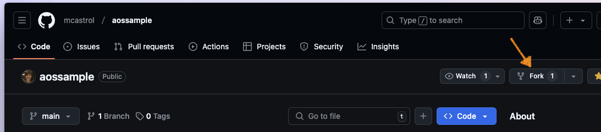
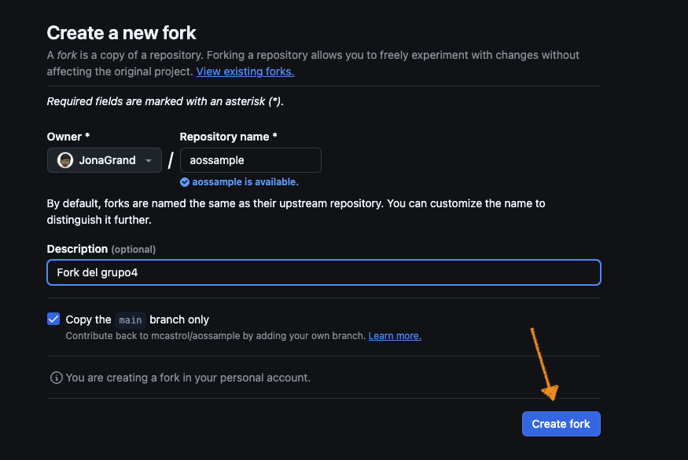
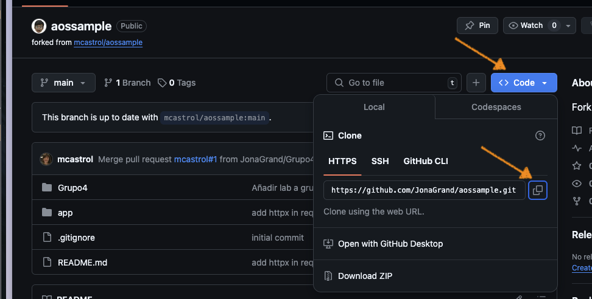
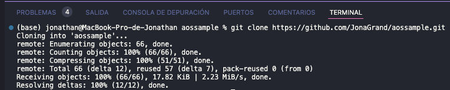
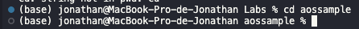
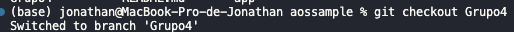
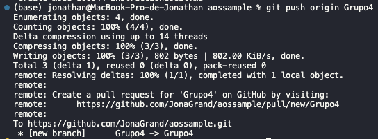
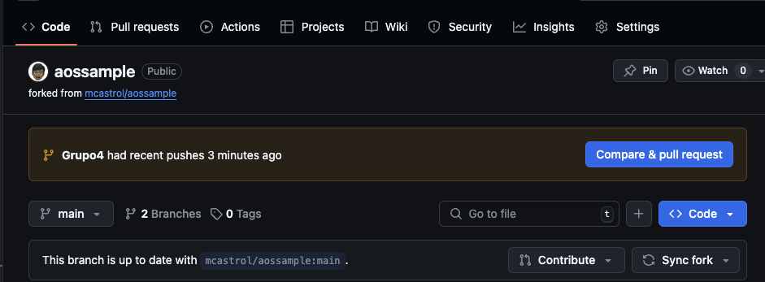
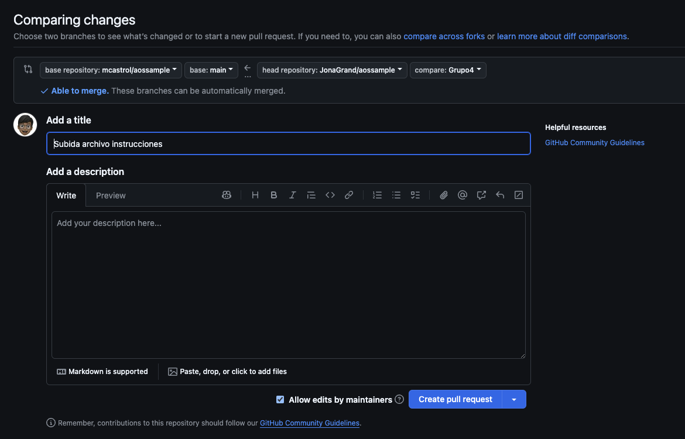
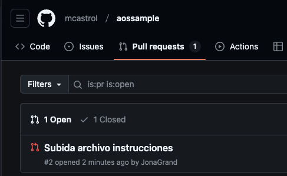

# Colaboración con el proyecto AOSSAMPLE

## **1. Consideraciones previas:**

Esto es un repositorio público en el cual no tenemos permisos, por lo que no podemos trabajar directamente desde un clone de este, sino que previamente

tenemos que haber realizado un fork (bifurcación) que nos creará una copia del repo en nuestra cuenta de github, este si que lo podremos clonar en nuestro local.

## **2. Pasos**

1. Tener configurada la cuenta de github con VSCode.

2. Abir la carpeta de nuestro ordenador donde queramos trabajar.

3. Crear un fork del proyecto, para esto tenemos que irnos a Github.com y navegar hasta el repositorio "https://github.com/mcastrol/aossample"

- Hacemos click en la opción de "Fork"

- Aceptamos.

4. Clonar el fork que tienes en tu cuenta de github:

- Para encontrar el link, vas a "Code > HTTPS"

- Escribes dentro de la terminal de VSCode: git clone "linkFork"

5. Cambiamos de directorio al del repo: cd aossample

6. Creamos una rama para nuestro grupo: git branch "GrupoX"

7. Nos movemos a la rama: git checkout "GrupoX"

8. Creamos una carpeta y metemos dentro los archivos de los labs.

- Lo puedes hacer de manera visual, no hace falta usar la terminal.

9. Añadir los cambios a la area de Staging: git add .

10. Confirmar los cambios: git commit -m "Mensaje descriptivo".

- En el mensaje tenéis que describir los cambios que estáis haciendo.

11. Subimos los cambios a la rama: git push origin "nombreRama".

12. Ahora ya tenemos los cambios en la rama de nuestro Grupo dentro del Fork (no están en la main del Fork).

- Para ir directamente a este repo, en la terminal con el resultado de el comando anterior, aparecerá un link.

**Ahora desde la web de [Github.com](http://Github.com), nos lo habrá abierto con el link anterior.**

13. Creamos una pull request para subirlo al repo original "mcastrol/aossample".

- En el mensaje que aparece, seleccionamos "Compare & pull request".

- Como queremos hacer la pull al original, es importante que arriba este seleccionado:

- base repository: mcastrol/aossample.

- base main:

- head repository: usuario/aossample.

- compare: GrupoX (nombreRama).

- El mensaje será el indicado en el commit, podemos darle una descripción tmb.

- Le damos a "Create pull request"

- Y ya estaría creada la pull request, en el caso de querer añadir comentarios, podemos hacerlo ahi.

14. Recordando que esto es un repo en el que no tenemos permisos, tenemos que esperar a que el autor acepte la pull request.

- Podemos ver la pull request tanto desde nuestro repo, como con el original (el de marcela), mirando dentro del apartado “pull requests”.

